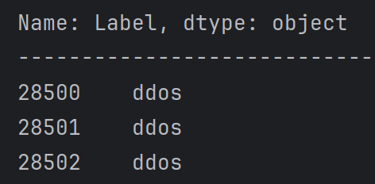

## Какой датасет будем использовать?
Проанализировав всё, до чего дотянулись мои рученьки, я остановился на датасете с простым и лаконичным названием **DDoS Dataset** 
Ссылка: https://www.kaggle.com/datasets/devendra416/ddos-datasets
## Почему он?
1. **Большой объём информации**. Этот датасет содержит в себе 3 других (относительно современных) датасета: CSE-CIC-IDS2018-AWS (https://www.unb.ca/cic/datasets/ids-2018.html), CICIDS2017 (https://www.unb.ca/cic/datasets/ids-2017.html), CIC DoS dataset(2016) (ссылка утеряна к сожалению)
2. **Разметка файла**. Каждый запрос к серверу маркирован внутри самого файла с помощью критерия Label. Отмечаются ddos и benign как атака и безопасный запрос соответственно.
3. **Более 80 выделенных признаков обнаружения**.
4. **Имеет две версии датасета**. Содержит как сбалансированный файл (12794627 датапоинтов и 84 признака, примерно 70% ddos атак и 30% безобидных запросов), так и несбалансированный файл (7616509 датапоинтов, 20% ddos 80% benign), который можно использовать как дополнительный в случае чего или как тестовый
5. Больше я ничего не придумал, он просто крутой и понравился мне. 

Да, может он не такой современный как CIC-DDoS2019 (этот мы не берём потому что атака производится всего на 1 сервер, тогда как в нашем файле из-за того, что он склеен из нескольких, то и атаки проводятся на несколько серверов), CICEV2023 мы вообще в рассчёт не берём, потому что там всё завязано на электрокарах, а у меня к ним личная неприязнь. Было очень много древних датасетов из девяностых - начала нулевых, например DAPRA98, DAPRA99, KDD99, CAIDA DDOS 2007  и т.д. В них представлены далеко не все методы ddos атак ввиду своей древности. Были и датасеты более широкого формата, которые рассматривали не только ddos атаки, а вообще множество киберпреступлений (IoT-23, ToN-IoT). Эти файлы нам не подходят из-за нашего узкого профиля работы. Были и платные датасеты, которые может быть лучше бы подошли для наших целей, но я бедный студент(

Пример разметки (до benign очень далеко листать, в датасете сначала ddos, а потом уже идут легитимные запросы):
